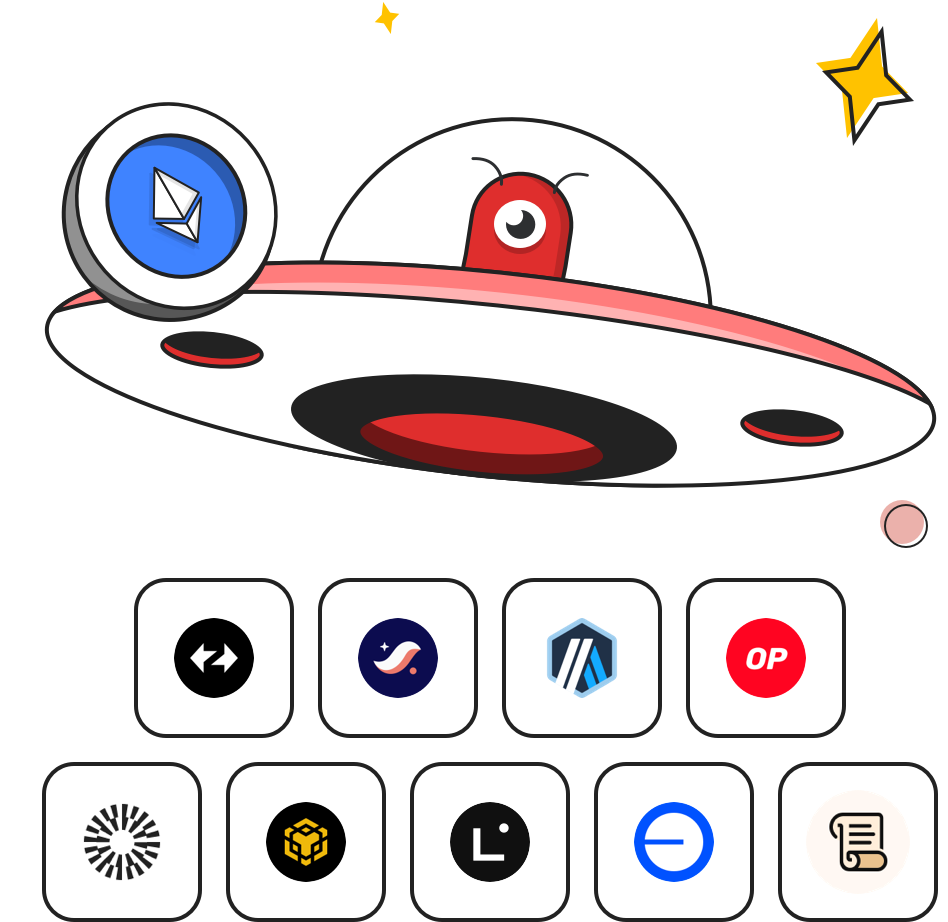

# Decentralized Cross-Chain Bridge

> A decentralized cross-chain bridge for transferring assets and data between different blockchain networks.

## Inscriptions Cross-Rollup Protocol

Building upon the existing cross-rollup communication, we've extended functionalities to encompass inscriptions minting and crossing.

The fundamental principle involves users submitting transactions containing basic inscriptions information and the identification code for the target network to the Maker Protocol. These transactions are processed by the Orbiter Bridge Protocol. On the target network, the Maker Protocol utilizes mint and cross functions to send inscriptions to the user's address, completing the entire inscriptions cross-rollup process.

Currently, this protocol supports networks including Arbitrum One, Optimism, zksyncEra, Base, Linea, Scroll, and PolygonZKEVM. The Orbiter Bridge Protocol collects a certain fee on the source network as the Inscriptions Cross-rollup Protocol fee.

	
### Inscriptions Minting

#### claim
|  Field   | Required  | Remark  |
|  ----  | ----  | ---- |
| p  | YES | Ex:xxx-20 Supported Protocol |
| op  | YES | claim Initiate Cross-rollup Mint Action |
| tick  | YES | EX:xxx-20 Inscriptions' Name |
| amt  | YES | Ex:1000 Mint Amount |

#### mint
|  Field   | Required  | Remark  |
|  ----  | ----  | ---- |
| p  | YES | Ex:xxx-20 Supported Protocol |
| op  | YES | mint Complete Cross-rollup Mint Action |
| tick  | YES | EX:xxx-20 Inscriptions' Name |
| amt  | YES | Ex:1000 Mint Amount |
| fc  | YES | Ex:1 InternalID of the Source Network|

### Inscriptions Crossing

#### cross

|  Field   | Required  | Remark  |
|  ----  | ----  | ---- |
| p  | YES | Ex:xxx-20 Supported Protocol |
| op  | YES | cross Initiate Cross Action |
| tick  | YES | EX:xxx-20 Inscriptions Name |
| amt  | YES | Ex:1000 Cross Amount |

#### crossover

|  Field   | Required  | Remark  |
|  ----  | ----  | ---- |
| p  | YES | Ex:xxx-20 Supported Protocol |
| op  | YES | crossover Complete Cross Action |
| tick  | YES | EX:xxx-20 Inscriptions' Name|
| amt  | YES | Ex:1000 Cross Amount |
| fc  | YES | Ex:1 InternalID of the Source Network |

### Supported Rollups
	Arbitrum One, Optimism, zksyncEra, Base, Linea, Scroll and PolygonZKEVM
